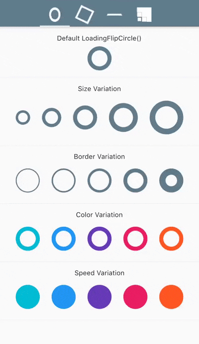
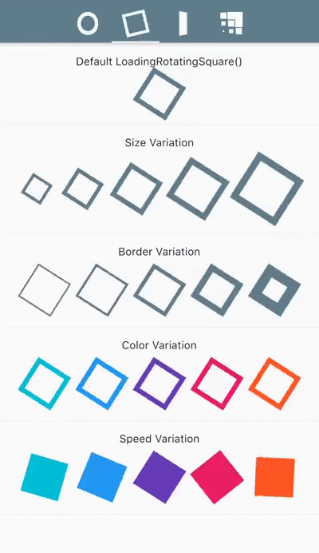
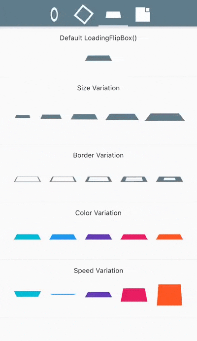
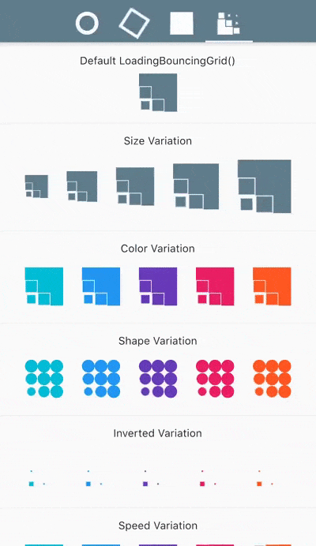

# Flutter Loading Animations

A simple yet very customizable set of loading animations for Flutter projects.

## Installation

Add the following to your `pubspec.yaml` file:

```yaml
...
dependencies:
  ...
  loading_animations: "^1.0.0"
...
```

Then import the file to your project:
```dart
import 'package:loading_animations/loading_animations.dart';
```

## How to use

Choose a loading animation from the list:
- FlipCircle
- RotatingSquare
- FlipBox
- BouncingGrid

Then add the following code:
```dart
LoadingFlipCircle(
  color: Colors.blue,
);
```
Or you can customize it a bit:
```dart
LoadingFlipCircle(
  borderColor: Colors.cyan,
  size: 30.0,
);
```
Or customize it even more!
```dart
LoadingFlipCircle(
  borderColor: Colors.cyan,
  borderSize: 3.0,
  size: 30.0,
  backgroundColor: Colors.cyanAccent,
  duration: Duration(milliseconds: 500),
);
```

For more customization, please look inside the loading animaton files.

Note: all the animations come ready to go just by calling `LoadingFlipBox()`, for example.

## Examples

For a more true experience of the animations and its variations,
download the example project and run using `flutter run --profile`.

<table>
<tr>
<td align="center">
LoadingFlipCircle()
</td>
<td align="center">
LoadingRotatingSquare()
</td>
</tr>
<tr>
<td align="center"></td>
<td align="center"></td>
</tr>
<tr>
<td align="center">
LoadingFlipBox()
</td>
<td align="center">
LoadingBouncingGrid()
</td>
</tr>
<tr>
<td align="center"></td>
<td align="center"></td>
</tr>

</table>


## Contribution

Please feel free to:
- ask questions
- report issues and bugs
- suggest code improvements
- request new features

Create an issue or a pull request and I will be more than happy to review it and add to the project.

## Thanks

This project was heavily based on https://cssfx.dev/

If you like this package, dont forget to hit the ⭐️ button!

Thanks and happy coding 👻

